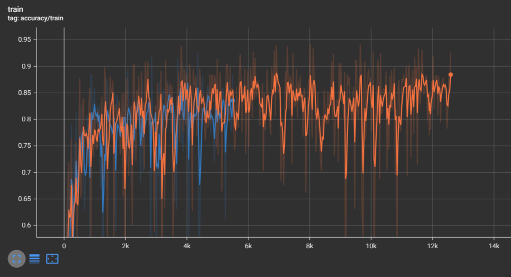

# FCN-8 implementation training and results:

after results from this, i have decided to replace the backbone with a modern swin-v2-t classifier. :D

### accuracy (achieved around 80-85% pixel accuracy)

### ground-truth/prediction:

### miou over time

### class label distribution in dataset :(

